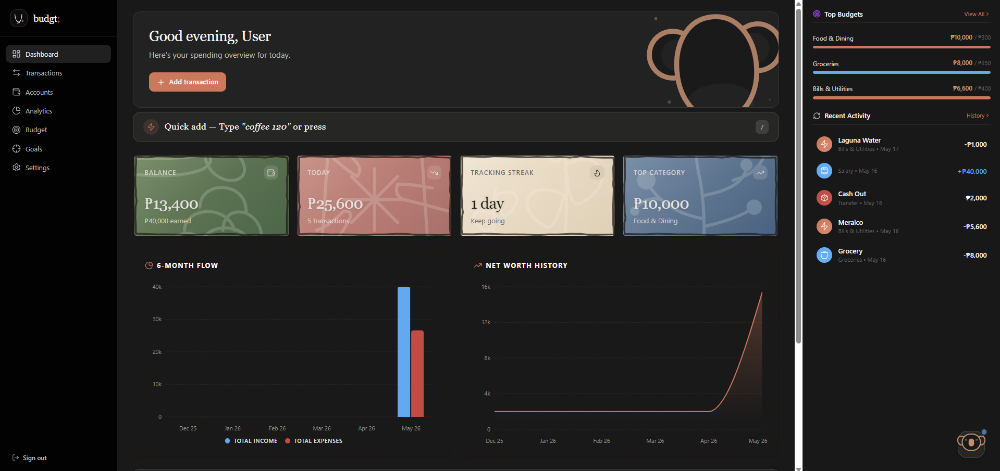

# budgt



A premium personal finance tracker built with React, Vite, and TailwindCSS.

## Features

- 📊 **Dashboard** — Balance overview, daily tracking streak, budget progress
- 💰 **Income & Expense Tracking** — Full transaction CRUD with category management
- 📈 **Analytics** — Interactive charts (donut, bar, area) with Recharts
- 🎯 **Budget Management** — Per-category spending limits with progress bars
- ⚙️ **Settings** — Profile, currency, notifications, theme toggle, CSV export
- 🌙 **Dark/Light Mode** — Premium dark-first design with smooth transitions

## Tech Stack

- **React 18** + **Vite 6** — Fast HMR and modern build tooling
- **TailwindCSS 4** — Utility‑first styling with custom design tokens
- **Radix UI** & **MUI** — Accessible component primitives and material design
- **Recharts** — Interactive data visualization
- **Framer Motion** — Fluid animations and page transitions
- **React Router 7** — Client‑side routing with animated transitions
- **Lucide React** — Clean, consistent iconography

## Getting Started

```bash
npm install
npm run dev
```

## Project Structure

```
├── package.json
├── vite.config.ts
├── tailwind.config.js (or .cjs)
├── postcss.config.mjs
├── index.html
├── public/          # static assets
└── src/
    ├── main.tsx           # Entry point
    ├── styles/            # Global styles and theme
    └── app/
        ├── routes.ts          # Route definitions
        ├── layout/            # App shell (sidebar, nav)
        ├── pages/             # Page components
        ├── components/        # Reusable UI components
        ├── context/           # State management (React Context)
        └── lib/               # Shared utilities
```

## License

MIT
